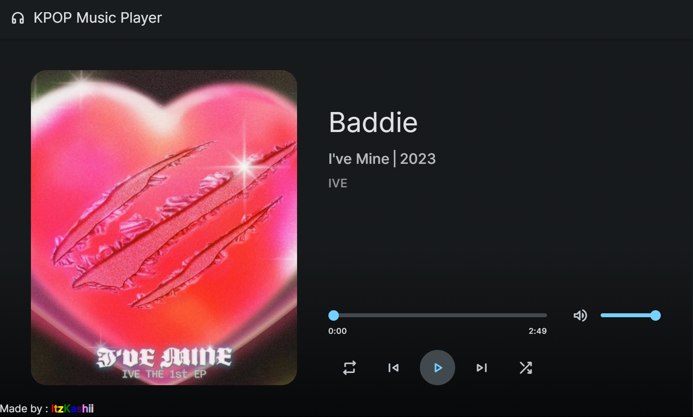

<div align="center">
<h2 align="center">🎧 KPOP Music Player</h2>

<h4 align="center">A KPOP web MUSIC PLAYER using javascript. Build in HTML , CSS and JS</h4>

<h5>Github Deploy</h5>
<a href="https://itzkashiii.github.io/KPOP-Music-Player/"><strong>🡆 Live Website</strong></a>

<h5>Repl.it Deploy</h5>
<a href="https://kpop-music-player.yuiishiro01.repl.co/"><strong>🡆 Live Website</strong></a>
</div>

### Simple Loading Screen


### Output



### Clone and Run
To run this __**KPOP Web Music Player**__, type and this command in Windows Powershell or other Terminal:
(Clone)
```bash
git clone https://github.com/ItzKashiii/KPOP-Music-Player.git
```
(Run)
If you're using `Visual Studio Code` download **Live Server** in the Extension tab. After downloading it, Make sure you're in `index.html` then below click the **Go live** And you're done. (Image example below)
### Server


### Other Infos
There are only 6 songs in the website, You can add more songs manually in the ```script.js``` file. Enjoy using it ^^


### Star
Star this repo if you like this repo, Thank you!
